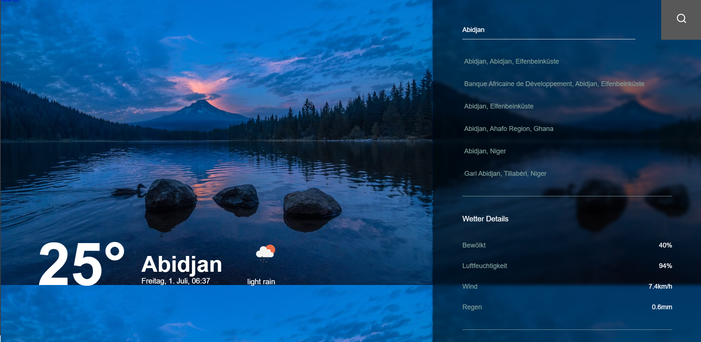

# Erste Schritte mit Create React App

Dieses Projekt wurde mit Typescript [Create React App](https://github.com/facebook/create-react-app).

Es gibt dazu Unittest aus verschiedene Library 
# um dieses Projekt zu starten 


```cmd 
 
npm install 
```
# dann

```cmd 
 
npm start
```

### `npm start`

Führt die Anwendung im Entwicklungsmodus aus.\
Öffnen Sie [http://localhost:3000](http://localhost:3000), um sie im Browser anzuzeigen.


Die Seite wird neu geladen, wenn Sie Bearbeitungen vornehmen.\
Außerdem werden alle Lint-Fehler in der Konsole angezeigt.




### um zu testen

### `npm test`

```cmd 
 
npm test --all

```
or
```cmd 
 
npm test --all

```